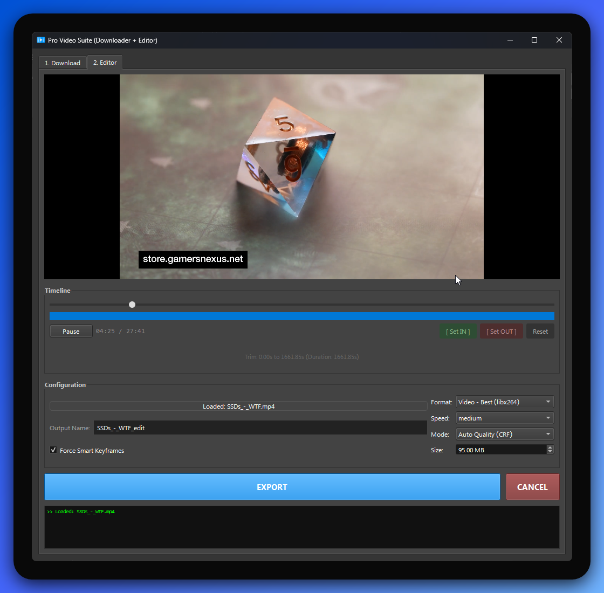

|  Pro Video Suite (Downloader + Editor) |
| :---: |
|  |

Welcome to the **Pro Video Suite**! This is a small, all-in-one desktop app that lets you
download videos from YouTube (and other supported sites) and edit them right away.

Whether you're just looking to save a video for offline viewing, trim a long clip, or
extract the audio as an MP3, this app has you covered.

> **Platforms:** built and tested primarily on **macOS** and **Linux**. Windows is still
> supported.

---

## 🟢 For Beginners: Getting Started

### What does this app do?
1. **Download Videos**: Paste a video link and the app downloads it at high quality.
2. **Trim & Cut**: Open any video file and keep only the part you want.
3. **Convert Formats**: Save your edit as an MP4, or extract just the audio as MP3/M4A.
4. **Control Quality**: Target an exact file size, or let the app pick the best quality.

### Prerequisites
You need three things installed and on your `PATH`:
1. **Python 3.9+** — the language the app is built with.
2. **FFmpeg** (`ffmpeg` + `ffprobe`) — trims, converts, and inspects videos.
3. **yt-dlp** — downloads videos.

Install the two external tools:

- **macOS** (Homebrew):
  ```bash
  brew install ffmpeg yt-dlp
  ```
- **Linux** (Debian/Ubuntu):
  ```bash
  sudo apt install ffmpeg
  pipx install yt-dlp        # or: sudo apt install yt-dlp
  ```
- **Windows** (winget):
  ```powershell
  winget install ffmpeg yt-dlp
  ```

> The app checks for these on startup and warns you (without crashing) if any are missing.

### Install and Run
From the project folder:

```bash
python3 -m venv .venv
source .venv/bin/activate          # Windows: .venv\Scripts\activate
pip install -e .
pro-video-suite                    # launches the app
```

`pro-video-suite` is installed as a command. You can also run it as a module, or with the
convenience launcher script:

```bash
python -m pro_video_suite
python run.py                # simplest — run from the project root inside the venv
```

**Launch it any time (no venv activation needed):**
```bash
~/Pro-Video-Suite/.venv/bin/pro-video-suite
```
This is the most reliable way to start the app. Tip: make it a one-word shortcut by adding
`alias pvs='~/Pro-Video-Suite/.venv/bin/pro-video-suite'` to your `~/.zshrc`.

### How to Use the App
- **Downloading**: On the **1. Download** tab, paste a YouTube URL and click
  **DOWNLOAD & LOAD**. Files save to your **Downloads** folder by default — change it with the
  **Save to → Choose…** button. Downloads are forced to H.264/AAC so they always preview, and
  when finished the video opens automatically in the editor. There's also an **Open a Video
  File to Edit** button here if you just want to edit a file you already have.
  - **Age-restricted or private videos** need your YouTube login. Tick **Use browser cookies**
    and pick a browser you're *signed in to YouTube* with — yt-dlp will use that session. If a
    download fails, the log now shows the real reason (e.g. "Sign in to confirm your age").
- **Editing**: On the **2. Editor** tab:
  - Click **📂 Open Video File** (top) to load a local file, or arrive here from a download.
  - Use the timeline slider to find the part you want.
  - Click **[ Set IN ]** to mark the start, **[ Set OUT ]** to mark the end.
  - **Configuration** and **Log** start collapsed to give the preview room — click their
    headers to expand them.
  - Pick your output format (Video or Audio Only) and click **EXPORT**.

### A note on formats macOS can't preview (e.g. AV1)
macOS's built-in video playback can't decode some codecs — **AV1** most commonly (YouTube
uses it), but others too. When you open such a file, the app automatically builds a small,
temporary H.264 **preview** in `~/.pro-video-suite/` so you can still see and scrub it. This
is detected automatically — if the preview renders no frames, the app switches to a proxy — so
it isn't limited to a fixed list of codecs. Your original file is never modified, **EXPORT
always uses the original** (full quality), and only one temporary preview ever exists (it's
overwritten and deleted automatically). No stray converted copies.

---

## 🛠️ For Developers: Under the Hood

### Tech Stack
- **GUI**: [PySide6](https://doc.qt.io/qtforpython-6/) (Qt for Python). Playback uses
  `QMediaPlayer` + a `QVideoSink`; frames are painted by a custom `VideoDisplay` widget
  (see below for why we avoid `QVideoWidget`).
- **Downloading**: `subprocess` calls to `yt-dlp` (with a lazily-downloaded Deno JS runtime).
- **Media processing**: `subprocess` calls to `ffmpeg` and `ffprobe`.

### Project Structure
```
src/pro_video_suite/
  __init__.py         # version / app name
  __main__.py         # entry point: QApplication, theme, icon, log filtering
  app.py              # VideoEditorApp — the main window and all editor logic
  workers.py          # QThreads: DownloadWorker (yt-dlp), ConversionWorker + ProxyWorker (ffmpeg)
  widgets.py          # VideoDisplay (sink painter), RangeBar (trim bar), CollapsibleSection
  platform_utils.py   # OS-specific helpers: asset paths, tool discovery, Deno download
  assets/             # app icons (.icns / .ico / .png / .svg)
tests/
  test_smoke.py       # headless construction test (Qt offscreen)
ProVideoSuite.spec    # cross-platform PyInstaller build recipe
```

All OS-specific behavior is isolated in `platform_utils.py`, so the UI and worker code
stay platform-agnostic. Notable cross-platform details:
- **Video preview** paints `QVideoSink` frames into a plain widget (`VideoDisplay`) instead
  of using `QVideoWidget`, whose native macOS layer overpaints adjacent controls and ignores
  size constraints.
- **Preview proxy for undecodable formats**: known-bad codecs (`PREVIEW_UNSUPPORTED_CODECS`,
  e.g. AV1) proxy immediately; anything else is detected at runtime — `VideoDisplay` counts
  rendered frames and `_verify_preview` falls back to `ProxyWorker` if a playing file renders
  zero frames. Export always uses the original file.
- **Worker threads** (download / export / proxy) are all stopped in `closeEvent`, so quitting
  mid-task doesn't abort the process.
- **Downloads force H.264/AAC** via a yt-dlp format *filter* (`bv*[vcodec^=avc1]+...`), not a
  soft `-S` sort, so previews always work.
- Monospace fonts use a fallback stack (`Menlo, Monaco, Consolas, …`) that resolves on
  every OS instead of relying on a Windows-only font.
- The Deno runtime and the preview proxy are cached under `~/.pro-video-suite/`, never inside
  the install dir.
- Windows-only encoders (NVENC/AMF) and console-hiding are gated behind OS checks.

### Developer Setup
```bash
python3 -m venv .venv
source .venv/bin/activate
pip install -e ".[dev]"       # app + pytest + pyinstaller
```

### Running Tests
Tests run headless via Qt's `offscreen` platform plugin (no display needed):
```bash
QT_QPA_PLATFORM=offscreen pytest -v
```

### Building a Standalone App
A single PyInstaller spec covers all three platforms:
```bash
pip install -e ".[dev]"                 # if you haven't already (installs pyinstaller)
pyinstaller --noconfirm ProVideoSuite.spec
```
- **macOS** → `dist/Pro Video Suite.app` (onedir bundle) — drag it into `/Applications`:
  ```bash
  cp -R "dist/Pro Video Suite.app" /Applications/
  ```
- **Linux** → `dist/ProVideoSuite` (single binary)
- **Windows** → `dist/ProVideoSuite.exe` (single binary)

The app still needs `ffmpeg` and `yt-dlp` installed on the machine (it shells out to them).
When launched from Finder/Dock, macOS gives apps a minimal `PATH`; the app adds the usual
Homebrew locations (`/opt/homebrew/bin`, `/usr/local/bin`) at startup so it can still find
them. A locally-built `.app` isn't code-signed — if Gatekeeper blocks it, right-click →
**Open** once to approve it.

> If the `.app` won't open, just run it from the terminal instead — that's the most reliable
> path: `~/Pro-Video-Suite/.venv/bin/pro-video-suite`.

CI workflows in `.github/workflows/` build each platform on demand
(`build-macos.yml`, `build-linux.yml`, `build-windows.yml`) and run the tests on every
push/PR (`test.yml`).

### Extending the Application
- **More encoders**: add hardware encoders in `VideoEditorApp.populate_encoders`.
- **Advanced FFmpeg filters**: extend the `-vf` chain in `VideoEditorApp.start_encoding`.
- **Batch/queue**: the app processes one job at a time; a `queue.Queue` would enable batches.
